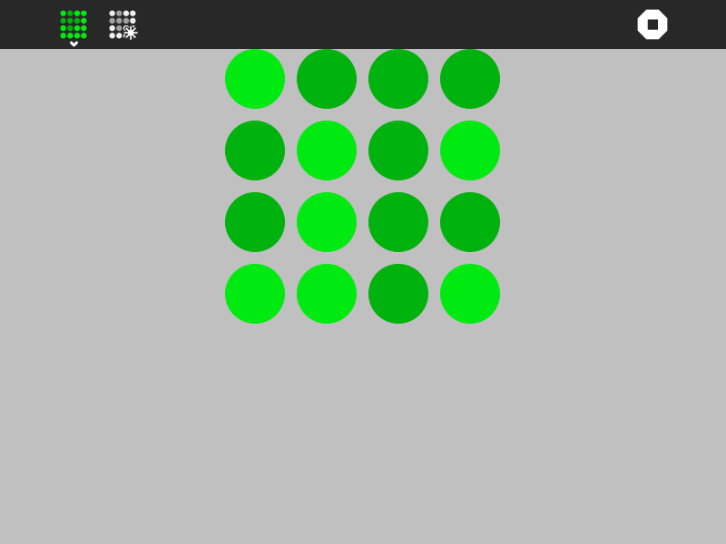

What is this?
=============

Flip activity is a simple strategy game where you flip "coins" in order to get all of them with the same side up. 

How to use?
===========

Flip activity is not part of the Sugar desktop but is often included.  Please refer to;

* [How to Get Sugar on sugarlabs.org](https://sugarlabs.org/),
* [How to use Sugar](https://help.sugarlabs.org/), and;
* [How to use Flip](https://wiki.sugarlabs.org/go/Activities/Flip).

How to upgrade?
===============

On Sugar Desktop systems;
* use [My Settings,](https://help.sugarlabs.org/my_settings.html), [Software Update](https://help.sugarlabs.org/my_settings.html#software-update)

